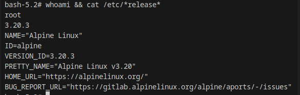

# Отчет по sk

## Задание 1. Образы и контейнеры Docker
### скриншот вывода результатов команды ifconfig (на Kali Linux) или ip a (на Ubuntu);

### скриншот вывода результатов команды sudo docker pull bash;

### скриншот вывода результатов команды sudo docker run -it bash;

### скриншот вывода результатов команды sudo docker stop names;

### скриншот вывода результатов команды sudo docker rm names;
 
 
### скриншот вывода результатов команды sudo docker rmi repository;

### скриншот вывода результатов команды sudo docker ps -a;

### скриншот вывода результатов команды sudo docker image ls.

## Задание 2. Bash в Docker
### скриншот вывода результатов команды sudo docker run –rm -it bash;

### скриншот вывода результатов команды whoami и cat /etc/*release* (в контейнере);

### скриншот вывода результатов команды ls -la / (в контейнере);

### скриншот вывода результатов команды whoami и cat /etc/*release* (в основной системе);

### скриншот вывода результатов команды ls -la / (в основной системе).

## Задание 3. Dockerfile
### скриншот вывода содержимого файла скрипта cat my_bash_1.sh (необходимо указывать назначенное вами имя скрипта);

### скриншот вывода содержимого файла Dockerfile cat Dockerfile;

### скриншот результатов сборки образа sudo docker build -t image_bash_1 . (необходимо указывать назначенное вами имя 

образа);

### скриншот результатов запуска контейнера sudo docker run –rm image_bash_1 (необходимо указывать назначенное вами имя образа);
 

### скриншот результатов запуска скрипта в основной системе ./my_bash_1.sh (необходимо указывать назначенное вами имя скрипта).

## Задание 4. Docker-compose
### скриншот вывода содержимого подготовленного вами файла index.html, содержащий ваше Ф.И.О.;

### скриншот вывода содержимого подготовленного вами файла docker-compose.yml;

### скриншот результатов запуска подготовленной вами связки контейнеров;

### скриншот первоначальной титульной страницы Nginx при подключении браузером к контейнеру;

### скриншот запуска связки контейнеров после замены файла index.html в контейнере, содержащий ваше Ф.И.О.;

### скриншот вашего варианта титульной страницы Nginx при подключении браузером к контейнеру, содержащий ваше Ф.И.О.;

### скриншот вывода результатов команды остановки связки контейнеров.

